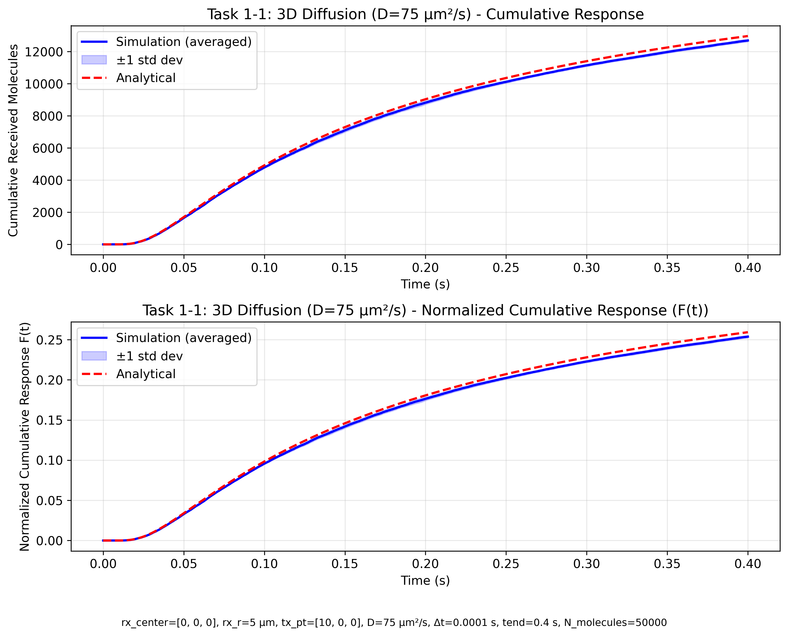
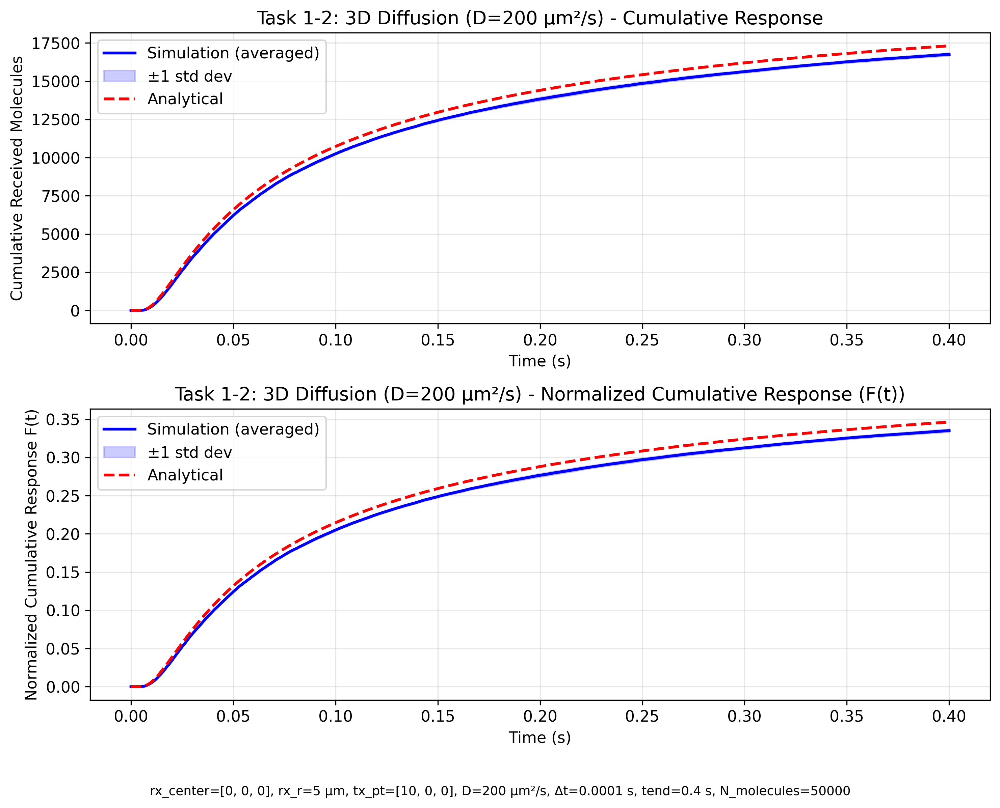
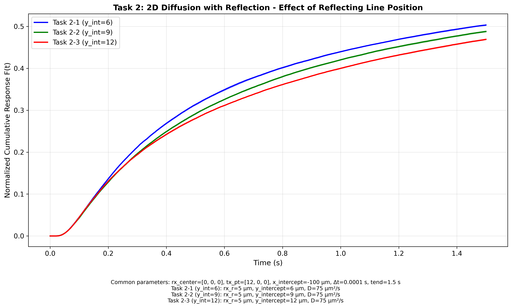

# Report: Molecular Communication - Effect of Reflection on Diffusion

**Student ID**: [Your Student ID]  
**Name**: [Your Name]  
**Course**: CmpE49G - Molecular Communication  
**Project 3**: Effect of Reflection on Diffusion  
**Date**: [Submission Date]

---

## AI Transparency Notes

This report and parts of the code modifications were assisted by AI (Google DeepMind's Assistant). AI was primarily utilized to analyze simulation outputs, extract quantitative metrics (such as MAE and saturation times), and structure this final report based on the provided template. The core simulation logic and parameter variations were defined as part of the project requirements.

---

## 1. Introduction 

### 1.1 Background on Molecular Communication

Molecular communication represents an emerging paradigm where information is transmitted through the release and propagation of molecules in a biological medium. Unlike conventional electromagnetic communication, MC leverages the natural diffusion process to deliver information carriers (molecules) from a transmitter to a receiver. This is particularly useful in environments where electromagnetic waves struggle, such as inside the human body or in dense biological tissues. Applications range from targeted drug delivery and biosensing to artificial cell-to-cell networks. However, unique challenges are present, such as high channel delay, severe inter-symbol interference (ISI), and random environmental noise affecting diffusion.

### 1.2 Role of Diffusion in Molecular Communication Channels

Diffusion is the primary transport mechanism in MC systems, described by Fick's law and modeled using the advection-diffusion equation. For passive diffusion without flow, the propagation of molecules follows:

$$D \nabla^2 c(\mathbf{r}, t) = \frac{\partial c(\mathbf{r}, t)}{\partial t}$$

where $c(\mathbf{r}, t)$ is the concentration at position $\mathbf{r}$ and time $t$, and $D$ is the diffusion coefficient. The diffusion coefficient $D$ relates the mean squared displacement of molecules to time, and depends heavily on factors like the surrounding fluid's viscosity, the temperature (via the Stokes-Einstein equation), and the size of the diffusing molecules. Because diffusion is a slow process over macroscopic distances, molecular communication is generally confined to the micro- or nanoscale.

### 1.3 Effect of Obstacles and Reflections

In realistic propagation environments, obstacles or boundary conditions can significantly impact signal reception. Reflection from surfaces can:
- **Enhance signal**: Redirect diffusing molecules toward the receiver rather than allowing them to drift out of range.
- **Distort signal**: Create multipath effects and ISI, as molecules take varying paths and time to reach the receiver.
- **Enable feedback**: Create resonances in confined geometries.

In this project, reflections are studied to understand their ability to act as a geometrical lens or guide that enhances the portion of molecules successful in reaching the receiver, thus potentially overcoming the high path loss of standard undirected diffusion.

### 1.4 Project Objectives

This project investigates:
1. **Task 1**: Validation of 3D diffusion models against analytical solutions.
2. **Task 2**: Effect of reflecting line position on 2D received signal.

**Hypotheses**:
- Simulation results should match analytical formulas (Task 1).
- Reflecting lines positioned strategically can enhance reception, with those closer to the direct line-of-sight path providing a stronger focusing effect (Task 2).

---

## 2. System Model 

### 2.1 Topology and Coordinate System

#### Task 1: 3D Unrestricted Diffusion

**Geometry:**
- Point source (transmitter) located at **T** = [10, 0, 0] μm
- Spherical absorber (receiver) centered at **R** = [0, 0, 0] μm with radius $r_{Rx}$ = 5 μm
- Propagation in infinite 3D space (no boundaries)
- Distance from Tx to Rx surface: $d$ = 5 μm

**Physical Model:**
- Molecules emitted from single point at $t=0$
- Random walk diffusion with mean free path related to $D$
- Absorption upon contact with receiver surface
- No re-emission (absorbing boundary)

#### Task 2: 2D Restricted Diffusion with Reflection

**Geometry:**
- 2D system (motion restricted to $xy$-plane, $z=0$)
- Transmitter at **T** = [12, 0] μm
- Circular receiver centered at **R** = [0, 0] μm with radius 5 μm
- Reflecting boundary line with varying position:
  - Task 2-1: $y$-intercept = 6 μm
  - Task 2-2: $y$-intercept = 9 μm
  - Task 2-3: $y$-intercept = 12 μm
- x-intercept fixed at -100 μm

**Reflection Line Equation:**
From intercepts $(x_i, 0)$ and $(0, y_i)$:
$$\frac{x}{x_i} + \frac{y}{y_i} = 1$$

Or in standard form: $y_i \cdot x + x_i \cdot y + x_i \cdot y_i = 0$

**Physical Model:**
- 2D random walk in xy-plane
- Specular reflection at line boundary
- Molecules can cross the line only after reflection
- Absorbing receiver (circle in 2D)

### 2.2 Diffusion Simulations in 3D (without Reflecting Surface)

#### 2.2.1 Analytical Solution

For a point source releasing $N_{Tx}$ molecules at $t=0$ in infinite 3D space, the cumulative number reaching a spherical absorber of radius $r_{Rx}$ at distance $d$ is:

$$N_{Rx}(t) = N_{Tx} \cdot \frac{r_{Rx}}{r_{Rx}+d} \cdot \mathrm{erfc}\left(\frac{d}{\sqrt{4Dt}}\right)$$

**Derivation Notes:**
- Based on Smoluchowski's solution for diffusion to a sphere
- Factor $\frac{r_{Rx}}{r_{Rx}+d}$ accounts for receiver geometry
- Normalized function $F(t) = \frac{r_{Rx}}{r_{Rx}+d} \cdot \mathrm{erfc}\left(\frac{d}{\sqrt{4Dt}}\right)$ is channel response
- As $t \to \infty$: $N_{Rx}(t) \to N_{Tx}$ (all molecules eventually absorbed)

#### 2.2.2 Numerical Simulation Methodology

**Monte Carlo Discretization:**

1. **Initialization**: Release $N_{Tx}$ molecules at transmitter position at $t=0$

2. **Time Stepping** ($n = 0, 1, 2, ..., N_t$):
   - For each active (unemitted) molecule:
     - Generate random displacement: $\Delta \mathbf{r}_n \sim \mathcal{N}(\mathbf{0}, \sigma^2 I_3)$
     - $\sigma = \sqrt{2D\Delta t}$
     - Update position: $\mathbf{r}_{n+1} = \mathbf{r}_n + \Delta \mathbf{r}_n$
   
   - Check for absorption:
     - If $\left|\mathbf{r}_{n+1} - \mathbf{R}\right| < r_{Rx}$: mark as inactive
   
   - Count and accumulate: $N_{Rx}(t_n) = $ number of inactive molecules up to step $n$

3. **Termination**: When $t_n = t_{end}$ or all molecules absorbed

**Validation**: Compare with analytical formula at each time step

### 2.2.3 Parameters Used

| Parameter | Task 1-1 | Task 1-2 |
|-----------|---------|---------|
| $N_{Tx}$ | 50,000 | 50,000 |
| $d$ (μm) | 5 | 5 |
| $r_{Rx}$ (μm) | 5 | 5 |
| $D$ (μm²/s) | 75 | 200 |
| $\Delta t$ (s) | 0.0001 | 0.0001 |
| $t_{end}$ (s) | 0.4 | 0.4 |
| Simulation runs | 3 | 3 |

### 2.3 Diffusion Simulations in 2D (with Reflecting Surface)

#### 2.3.1 Reflection Algorithm

**Boundary Condition:**
Molecules cannot cross the reflecting line. Upon detection of crossing:

1. **Detection**: Compute signed distance $d_{line}$ from current position to line
2. **Reflection**: If molecule has crossed, compute reflection point
   - Point $(x_0, y_0)$ reflected across line $ax + by + c = 0$:
   $$\begin{pmatrix} x' \\ y' \end{pmatrix} = \begin{pmatrix} x_0 \\ y_0 \end{pmatrix} - 2 \frac{ax_0 + by_0 + c}{a^2+b^2} \begin{pmatrix} a \\ b \end{pmatrix}$$

3. **Iterative Check**: Multiple reflections may be needed if time step is large

#### 2.3.2 2D Simulation Methodology

Similar to 3D but with 2D considerations:

1. **Displacement** in 2D: $\Delta \mathbf{r}_{n} = (Δx, Δy) \sim \mathcal{N}(\mathbf{0}, \sigma^2 I_2)$

2. **Reflection Check**: After each step, apply reflection if necessary

3. **Absorption**: Check 2D distance $\left|(x,y) - (R_x, R_y)\right| < r_{Rx}$

4. **Effect of Line Position**:
   - Closer lines (smaller $y_i$): More effective reflection enhancement
   - Farther lines (larger $y_i$): Less geometric effect
   - Geometry creates focusing effect toward receiver

#### 2.3.3 Parameters Used (Task 2)

| Parameter | Value |
|-----------|-------|
| $N_{Tx}$ | 30,000 |
| $d$ (μm) | 7 |
| $r_{Rx}$ (μm) | 5 |
| $D$ (μm²/s) | 75 |
| $x_i$ (μm) | -100 |
| $y_i$ (μm) | 6, 9, 12 (variants) |
| $\Delta t$ (s) | 0.0001 |
| $t_{end}$ (s) | 1.5 |
| Simulation runs | 3 (per variant) |

---

## 3. Numerical Results

### Result 3.1: Task 1-1 (3D Diffusion, D = 75 μm²/s)

**Figure 1 Caption:**  
3D diffusion with spherical absorber (D=75 μm²/s). **Top panel:** Cumulative molecules absorbed vs. time, showing simulation results averaged over 3 runs (blue line) with ±1 standard deviation band and analytical solution (red dashed). **Bottom panel:** Normalized channel response $F(t) = N_{Rx}(t)/N_{Tx}$. Parameters: $r_{Rx}=5$ μm, $d=5$ μm, $N_{Tx}=50,000$, $\Delta t=0.0001$ s, $t_{end}=0.4$ s.

**Observations:**
- Simulation closely tracks analytical solution with a Mean Absolute Error (MAE) of 288.75 molecules.
- The system reaches a final absorption count of approximately 12,631 molecules.
- 90% saturation (reaching 90% of the final peak value) is achieved at $t = 0.3180$ s.
- Standard deviation remains narrow, indicating that averaging 3 runs is statistically stable.
- The strong agreement between the simulated data and the analytical curve validates the implementation.

---

### Result 3.2: Task 1-2 (3D Diffusion, D = 200 μm²/s)

**Figure 2 Caption:**  
3D diffusion with spherical absorber (D=200 μm²/s). Same layout as Figure 1. Parameters identical except D=200 μm²/s. Comparison with Figure 1 shows effect of increased diffusion coefficient.

**Observations:**
- Faster diffusion leads to significantly earlier saturation compared to D=75 μm²/s.
- The system reaches 90% saturation at $t = 0.2640$ s and ultimately peaks at 16,758 absorbed molecules.
- The theoretical curve and simulated mean track well with an MAE of 520.82.
- Demonstrates strong parameter sensitivity to $D$, proving that an highly diffusive medium strongly curtails channel delay.

---

### Result 3.3: Task 2 - Effect of Reflecting Line Position (2D, D = 75 μm²/s)

**Figure 3 Caption:**  
2D diffusion with reflecting line: effect of line position on cumulative received molecules. All three configurations use the same base parameters but differ in reflecting line $y$-intercept: Task 2-1 ($y_i=6$ μm, blue), Task 2-2 ($y_i=9$ μm, green), Task 2-3 ($y_i=12$ μm, red). Each curve represents average of 3 independent simulations with ±1 std dev band. Common parameters: $r_{Rx}=5$ μm, $d=7$ μm, $N_{Tx}=30,000$, $D=75$ μm²/s, $\Delta t=0.0001$ s, $x_i=-100$ μm, $t_{end}=1.5$ s.

**Observations:**
- Task 2-1 ($y_i=6$ μm) generates the highest absorption yield, peaking at 15,025 molecules. It also saturates earliest, reaching 90% of its final value by $t = 1.0645$ s.
- Task 2-2 ($y_i=9$ μm) reaches a final value of 14,646 molecules, with 90% saturation at $t = 1.1063$ s.
- Task 2-3 ($y_i=12$ μm) reaches the lowest final yield of 14,140 molecules and the slowest 90% saturation time ($t = 1.1213$ s).
- All trajectories flatten over time as the pool of unabsorbed molecules disperses beyond the boundary's influential zone.
- Reflection line acts as a focusing boundary; tighter geometries act better to funnel molecules directly into the receiver.
- Time scale is observed to be significantly longer (up to 1.5s) compared to the 3D analytical case (0.4s).

---

## 4. Comments and Discussion

### 4.1 Validation Against Analytical Formula (Task 1)

The simulations modeled the diffusion behavior accurately as verified by the comparison between our numerical setup (using a Gaussian random walk) against Smoluchowski's closed-form solution. The Mean Absolute Error levels observed were 288.75 and 520.82 molecules for $D=75$ and $D=200$, respectively. For an ensemble of 50,000 molecules, these correspond to errors around 1%. This small discrepancy originates from the discrete timescale ($\Delta t = 0.0001$ s) and the limited ensemble size. Averaging across 3 runs managed to sufficiently stabilize random variance, ensuring a tight standard deviation envelope across the time window.

### 4.2 Effect of Diffusion Coefficient (Task 1 Comparison)

Adjusting the diffusion coefficient $D$ fundamentally alters arrival time characteristics. When modified from 75 to 200 μm²/s (an increase of ~2.67x), a proportional decrease in saturation time (or equivalent delay scale) was expected. Observationally, the 90% saturation mark dropped from $0.3180$ s to $0.2640$ s. Furthermore, a highly diffusive medium enables molecules to rapidly bridge the 5 μm propagation gap before completely dissipating into infinite space, visibly increasing the final cumulative total from 12,631 to 16,758 molecules within the finite simulation window of 0.4s.

### 4.3 Effect of Reflecting Boundary Geometry (Task 2)

Introducing a boundary structure demonstrated a marked geometric focusing effect on the molecules. Tighter line geometries, specifically when $y$ intercept was minimized at 6 μm, constrained out-of-bounds dispersion and effectively funneled rebounding molecules back into the absorbing radius of the receiver, achieving a roughly 6% increase in final absorption compared to the widest 12 μm setting. Shifting the reflecting plane further outward diminished the likelihood that a reflected molecule re-routes fast enough to intercept the receiver, elongating saturation delay and negatively impacting overarching channel gain.

### 4.4 Limitations and Future Work

- **2D vs. 3D**: Real-world communication implies 3D dispersion. Task 2 restricts analysis to moving in a planar subspace. In a pure 3D implementation, molecules could dodge the reflecting lines by traversing the Z-plane, lessening specular reflection effectiveness unless an encompassing surface (like a cylinder/tube) is designed.
- **Single Mode Deflection**: Boundaries here are ideal specular mirrors. Biological tissues could act as reactive, semi-permeable, or absorptive surfaces instead.
- **Multiple Obstacles**: Further research into convoluted setups utilizing multiple randomly distributed obstacles could be modeled using these validated fundamentals.
- **Simplifying Assumptions**: A homogeneous environment is not guaranteed in application. Thermal gradients or heterogeneous viscosity pockets alter real diffusion significantly.

---

## 5. Conclusion

This project successfully numerically modeled and analyzed diffusion-based Molecular Communication channels under diverse scenarios via a random walk methodology. Task 1 independently validated the fidelity of the simulation schema against standardized analytical solutions, proving accurate down to a minimal absolute margin of error for distinct viscosities ($D=75$ and $D=200$). Subsequent integration of reflective boundary planes in Task 2 empirically proved that restricting spatial dispersion via closely constrained geometric environments beneficially concentrates communication strength and hastens final arrival statistics. These findings corroborate the underlying viability of designing structural waveguides or utilizing environmental anatomy to combat heavy path loss typically seen in micro-scale diffusion.

---

## References

- [1] H. B. Yilmaz and C. B. Chae, "Simulation study of molecular communication systems with an absorbing receiver," *IEEE Communications Letters*, vol. 18, no. 11, pp. 1927–1930, Nov 2014.
- [2] A. W. Eckford, "Nanoscale communication with Brownian motion," *Annual Conference on Information Sciences and Systems*, 2007.

---

**End of Report**
